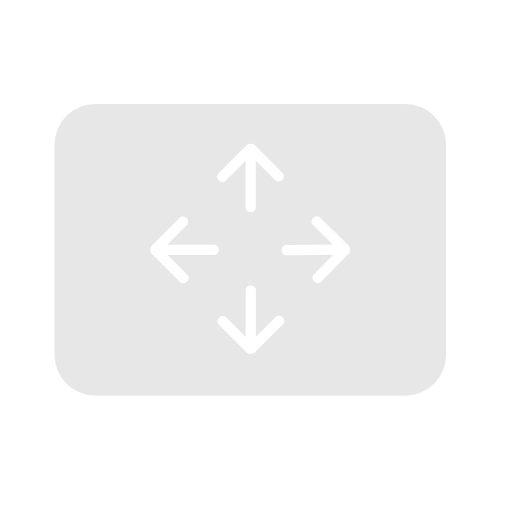

# Tabula

Tabula is a small MacOS application to enable scrolling with one finger by holding down a modifier key.

This is trying to imitate the behavior of the middle mouse button on Windows.

Thanks a lot for the base algorithm of [arifiorino/Scroller](https://github.com/arifiorino/Scroller).

## Why?

I use a split keyboard with a trackpad on the right side that I use with my thumb. This is great for moving the mouse around, but scrolling without moving my hand is not possible.

So I made this to enable to not have to move my hand :D

## Features

- Change modifier key
- Change scroll speed
- Toggle x and y axis

## Download

You can download the latest version from the [Releases](https://github.com/keyruu/Tabula/releases) page.

brew is coming soon.
